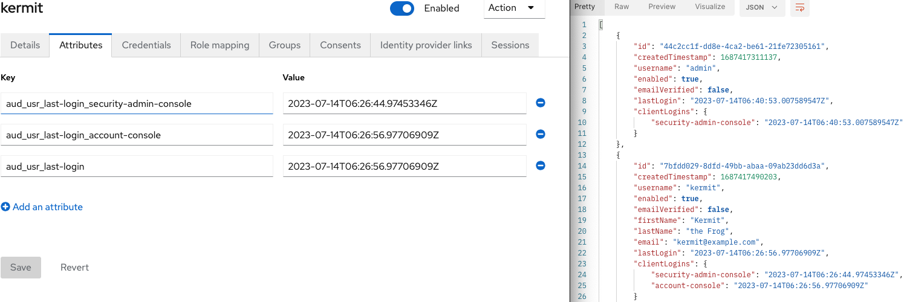
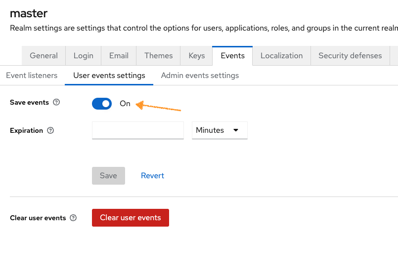
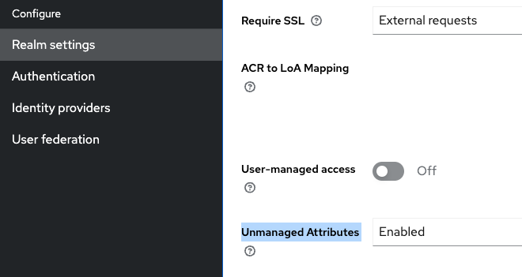

[](https://github.com/ContinuousSecurityTooling/keycloak-auditor/actions/workflows/build.yml)
[](https://sonarcloud.io/dashboard?id=ContinuousSecurityTooling_keycloak-auditor)
[](https://sonarcloud.io/dashboard?id=ContinuousSecurityTooling_keycloak-auditor)
[](https://www.npmjs.com/package/@continuoussecuritytooling/keycloak-auditor)
[](https://snyk.io/test/github/ContinuousSecurityTooling/keycloak-auditor)

# Keycloak Auditor

A Keycloak module to store audit data for user logins. The last logins will be saved as user attributes.

All events created by this listener follow a schema:

`aud_<resource-type>_<audit-event>(_<client>)`:`<TIME_STAMP>`

To retrieve the login data structure you can use a custom endpoint extensions via Keycloak Admin API:
```
curl ... http://localhost:8080/realms/master/auditing/users
```

For further automated reporting, you can use [keycloak-reporter](https://github.com/ContinuousSecurityTooling/keycloak-reporter) additionally.

See example for the docker-compose setup in `.bin/read-audited-users.sh`.



```
[
    {
        "id": "44c2cc1f-dd8e-4ca2-be61-21fe72305161",
        "createdTimestamp": 1687417311137,
        "username": "admin",
        "enabled": true,
        "emailVerified": false,
        "realm": "master",
        "lastLogin": "2023-07-14T06:26:30.639007384Z",
        "clientLogins": {
            "security-admin-console": "2023-07-14T06:26:30.639007384Z"
        }
    },
    {
        "id": "7bfdd029-8dfd-49bb-abaa-09ab23dd6d3a",
        "createdTimestamp": 1687417490203,
        "username": "kermit",
        "enabled": true,
        "emailVerified": false,
        "firstName": "Kermit",
        "lastName": "the Frog",
        "email": "kermit@example.com",
        "realm": "master",
        "lastLogin": "2023-07-14T06:26:56.97706909Z",
        "clientLogins": {
            "security-admin-console": "2023-07-14T06:26:44.97453346Z",
            "account-console": "2023-07-14T06:26:56.97706909Z"
        }
    }
]
```

>**NOTE**:
>
> The regular Keycloak ADMIN API Authentication is used.

## Setup

Prerequisites:
* JDK 17+
* Docker

Build and start:

```bash
# Build the extension
mvn clean package -DskipTests

# Start keycloak and MySQL database
docker-compose up -d
```

The Keycloak server will now be available on <http://localhost:8080>. You can log into the Administration Console using “**admin**” as both username and password.

## Deploy into a standalone keycloak server

>**NOTE**:
> Instead of building yourself, you can pick the latest release JAR.

1. Copy the JAR from [releases](https://github.com/ContinuousSecurityTooling/keycloak-auditor/releases/latest) to `/opt/keycloak/providers` (Keycloak>=22)
> **NOTE:**
For Keycloak 20 & 21 use the SPI JAR from [0.3.1](https://github.com/ContinuousSecurityTooling/keycloak-auditor/releases/tag/v0.3.1)
For Keycloak Legacy (<=19) Use the EAR from [0.3.1](https://github.com/ContinuousSecurityTooling/keycloak-auditor/releases/tag/v0.3.1) and copy it to `opt/jboss/keycloak/standalone/deployments/`
2. Enable event listener:




3. Enable Unmanged attributes:



4. To use the REST endpoint (e.g. `http://localhost:8080/master/realms/${KEYCLOAK_REALM}/auditing/users`) create a client which uses client credentials grant
   * `full scope` needed for the client
   * Realm Role Mapping neeeded

## Configuration

* `KC_AUD_DISABLE_EXTERNAL_ACCESS` - To disable API being externally accessible to a cluster. Set the environment variable 'AUD_DISABLE_EXTERNAL_ACCESS'. Once set enable the header 'X-Forwarded-Host' on your proxy. This is enabled by default on HA Proxy on Openshift. Defaults to `false`
* `KC_AUD_DISABLE_ROLE_CHECK` - To disable realm access check set value to `true`. Defaults to `false`
* `KC_AUD_DEFAULT_ROLE` - Set the role the client needs to have. Defaults to `admin`
* `KC_AUD_GLOBAL_MASTER_ACCESS` - Enable client in master account to iterate to over realms, Default o `false`.

You can also the NPM package `@continuoussecuritytooling/keycloak-auditor` to directly use the rest endpoint:

```
import { AuditClient } from '@continuoussecuritytooling/keycloak-auditor';

const keycloakUrl = '';
const clientId = '';
const clientSecret = '';

const kcClient = new AuditClient(keycloakUrl, 'master');
// client login
await kcClient.auth({
    clientId: clientId,
    clientSecret: clientSecret,
    grantType: 'client_credentials',
});
const users = await client.userListing();
const clients = await client.clientListing();
```
